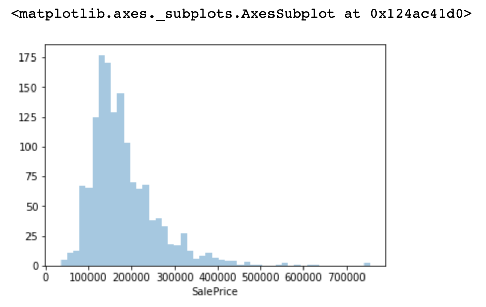
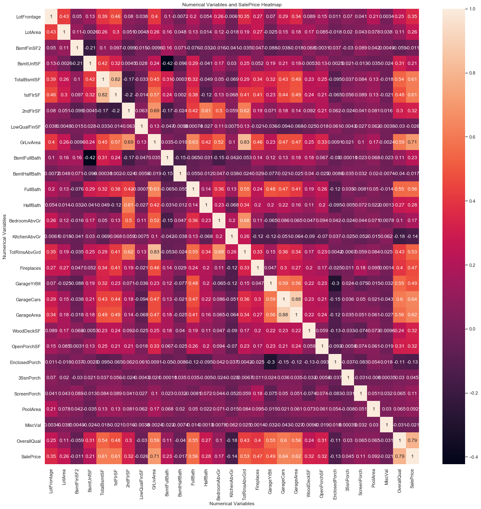
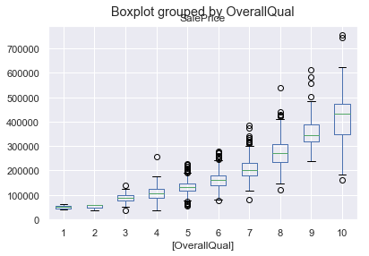
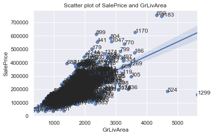
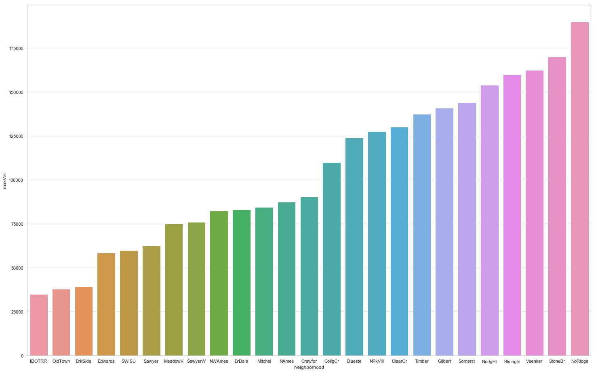

# House Prices - Advanced Regression Techniques 

## Predict sales prices and practice feature engineering, RFs, and gradient boosting 

## Introduction

The problem involves predicting house prices based on various house features provided in dataset. This is originally a competition problem in [kaggle.com](https://www.kaggle.com/c/house-prices-advanced-regression-techniques/overview). 

Based on the dataset and problem requirements, the article begin with descriptions about the problem, following illustrations on Dataset. Later on, there are more detailed and descriptive content on dataset, including statistical description on important features and visualization. After exploring the dataset and related features, some feature engineering techniques will be applied to select more significant features that will grant a better result in prediction later on. Finally, several regression models will be applied and the effects and performances of the models will be compared and analysis. 

## Problem

An usual home buyer would not consider detailed construction characteristics while making a purchase choice. However, the problem presents more comprehensive information on house features, including locations/neighborhoods information and detailed house construction features. The goal is to predict house price based on given features. 

## Dataset

There are 79 explanatory variables in various datatype. There are training and testing dataset on Kaggle. For a detailed presentation of dataset, please visit [data description](https://www.kaggle.com/c/house-prices-advanced-regression-techniques/data). 

## Data Description 

### Datasize and Structure Overview 

There are character and integer variables. There are ordinal factors, categorical variables as well as numerical variables. In total, there are 81 variables and one Id variable and one response variable (Sale Price). Below is only an overview of the variables.

```python
import pandas as pd

train = pd.read_csv('./data/train.csv')
train.info(verbose=True)
```

Results from the data description 

``` text
<class 'pandas.core.frame.DataFrame'>
RangeIndex: 1460 entries, 0 to 1459
Data columns (total 81 columns):
Id               1460 non-null int64
MSSubClass       1460 non-null int64
MSZoning         1460 non-null object
LotFrontage      1201 non-null float64
LotArea          1460 non-null int64
Street           1460 non-null object
Alley            91 non-null object
LotShape         1460 non-null object
LandContour      1460 non-null object
Utilities        1460 non-null object
LotConfig        1460 non-null object
LandSlope        1460 non-null object
Neighborhood     1460 non-null object
Condition1       1460 non-null object
Condition2       1460 non-null object
BldgType         1460 non-null object
HouseStyle       1460 non-null object
OverallQual      1460 non-null int64
OverallCond      1460 non-null int64
YearBuilt        1460 non-null int64
YearRemodAdd     1460 non-null int64
RoofStyle        1460 non-null object
RoofMatl         1460 non-null object
Exterior1st      1460 non-null object
Exterior2nd      1460 non-null object
MasVnrType       1452 non-null object
MasVnrArea       1452 non-null float64
ExterQual        1460 non-null object
ExterCond        1460 non-null object
Foundation       1460 non-null object
BsmtQual         1423 non-null object
BsmtCond         1423 non-null object
BsmtExposure     1422 non-null object
BsmtFinType1     1423 non-null object
BsmtFinSF1       1460 non-null int64
BsmtFinType2     1422 non-null object
BsmtFinSF2       1460 non-null int64
BsmtUnfSF        1460 non-null int64
TotalBsmtSF      1460 non-null int64
Heating          1460 non-null object
HeatingQC        1460 non-null object
CentralAir       1460 non-null object
Electrical       1459 non-null object
1stFlrSF         1460 non-null int64
2ndFlrSF         1460 non-null int64
LowQualFinSF     1460 non-null int64
GrLivArea        1460 non-null int64
BsmtFullBath     1460 non-null int64
BsmtHalfBath     1460 non-null int64
FullBath         1460 non-null int64
HalfBath         1460 non-null int64
BedroomAbvGr     1460 non-null int64
KitchenAbvGr     1460 non-null int64
KitchenQual      1460 non-null object
TotRmsAbvGrd     1460 non-null int64
Functional       1460 non-null object
Fireplaces       1460 non-null int64
FireplaceQu      770 non-null object
GarageType       1379 non-null object
GarageYrBlt      1379 non-null float64
GarageFinish     1379 non-null object
GarageCars       1460 non-null int64
GarageArea       1460 non-null int64
GarageQual       1379 non-null object
GarageCond       1379 non-null object
PavedDrive       1460 non-null object
WoodDeckSF       1460 non-null int64
OpenPorchSF      1460 non-null int64
EnclosedPorch    1460 non-null int64
3SsnPorch        1460 non-null int64
ScreenPorch      1460 non-null int64
PoolArea         1460 non-null int64
PoolQC           7 non-null object
Fence            281 non-null object
MiscFeature      54 non-null object
MiscVal          1460 non-null int64
MoSold           1460 non-null int64
YrSold           1460 non-null int64
SaleType         1460 non-null object
SaleCondition    1460 non-null object
SalePrice        1460 non-null int64
dtypes: float64(3), int64(35), object(43)
memory usage: 924.0+ KB
```
Without response variable and variable `Id`, there are 79 features availabel, in different types. 


### SalePrice

```python
import numpy as np
import seaborn as sns
%matplotlib inline

sns.distplot(a=train['SalePrice'], hist=True, kde=False, rug=False, label='Density')
sns.plt.show()
```



The statistics summary of `SalePrice`.

```text
count      1460.000000
mean     180921.195890
std       79442.502883
min       34900.000000
25%      129975.000000
50%      163000.000000
75%      214000.000000
max      755000.000000
Name: SalePrice, dtype: float64
```


### Exploring some important variables 

#### Correlation with SalePrice

There are numerical variables in the dataset, to get a good overview of the relation between those numerical variables with response variable. Correlation is a good way to explore the relation between exploratory variables and response variable. 

```python
import matplotlib.pyplot as plt 
def get_numerical_features():
    return ['LotFrontage', 'LotArea', 'BsmtFinSF2', 'BsmtUnfSF', 'TotalBsmtSF', '1stFlrSF', '2ndFlrSF',
            'LowQualFinSF','GrLivArea','BsmtFullBath','BsmtHalfBath','FullBath','HalfBath','BedroomAbvGr',
            'KitchenAbvGr','TotRmsAbvGrd','Fireplaces','GarageYrBlt','GarageCars',
            'GarageArea','WoodDeckSF','OpenPorchSF','EnclosedPorch','3SsnPorch','ScreenPorch','PoolArea',
            'MiscVal','SalePrice']

numerical_features = get_numerical_features()
num_vars = train[numerical_features]
corr_matrix = num_vars.loc[:,numerical_features].corr()
plt.figure(figsize=(20,20))
ax = sns.heatmap(corr_matrix, annot=True)
ax.set(title="Numerical Variables and SalePrice Heatmap",
       xlabel="Numerical Variables",
       ylabel="Numerical Variables")
sns.set(font_scale=1)
```



There are two variables at the top correlation: `OverallQual` and `GrLivArea`, with correlation 0.79 and 0.71. There are issues of multicollinearity. The correlation between `GarageCars` and `GarageArea` is very high, and they both are highly correlated with `SalePrice`. `TotalBsmtSF`, `-1stFlrSF`, `FullBath`, `TotRmsAbvGrd`, `YearBuilt` and `YearRemodAdd` are also highly correlated with `SalePrice`. 

#### Exploring OverallQual



From the boxplot image, we observe that the positive correlation is certainly there indeed, as the boxes forms a slightly upward curve. I do not see any extreme values. 

#### Exploring GrLivArea 

```python
import numpy as np 
import seaborn as sns
import matplotlib.pyplot as plt

sns.set_theme(color_codes=True)
ax = sns.regplot(x='GrLivArea', y='SalePrice', data=train)
plt.title('Scatter plot of SalePrice and GrLivArea')

def label_point(x, y, val, ax):
    a = pd.concat({'x': x, 'y': y, 'val': val}, axis=1)
    for i, point in a.iterrows():
        ax.text(point['x']+.02, point['y'], str(point['val']))
        
label_point(train['GrLivArea'], train['SalePrice'], train['Id'], plt.gca())

```



There seems are two outliers, 524 and 1299 with low SalePrices and high GrLivArea. By observing the overall quality.

```python 
train.loc[[523, 1298],['SalePrice', 'GrLivArea', 'OverallQual']]
```
| Id | SalePrice | GrLivArea | OverallQual |
|----|-----------|-----------|-------------| 
| 524 | 184750 | 4676 | 10 |
| 1299 | 160000 | 5642 | 10 |

Observing from the result, the overallQual of those two points are quite high as well. So they could be candidates for outliers. 

## Handling Missing Values 

There are missing values for predictors in the dataset. Fixing missing values are part of the work that is necessary for the dataset. There are several approaches to process or impute missing values: replace it with mode value, replace it with mean value and replace with zeroes. 

## Label encoding/factoring the remaining character variables 

After all missing values and NAs are taken care of. Some character variables that will be taken care of in this process. There are variables with different ratings, such as Excellent, Good, Average/Typical, Fair and Poor, Yes/No, those are encoded into numbers that represents different levels. 

## Changing some numeric variables into factors 

For Year and Month Sold, years are included as a numerical variable but there is no significant difference between each year. So I decided to convert them into factors. For Month sold, for the same reason as Year sold, I decided to convert them into factors. 

For MSSubClass, the values are numbers but they are encoded to represent different categories. So I convert them into factors. 

## Feature engineering 

### Total number of bathrooms 

There are several bathroom related variables. `FullBath`, `HalfBath`, `BsmtFullBath` and `BsmtHalfBath`. The way I would like to process them is add them together to a new variable `TotBathrooms`. 

```
    TotBathrooms = FullBath + HalfBath*0.5 + BsmtFullBath + BsmtHalfBath*0.5
```

### Year and Month Variables 

There are three variables related to house age. `YearBlt`, `YearRemodAdd` and `YearSold`. As some house are been remod and some are not, I introduce a new variable called `Remod`, so that it represents if the house has been remoded or not. `Age` parameters represents the time elapsed during the originally built and remoded. 

`Neighborhood` is another important categorical variable. I plot the neighborhoods against saleprice to get a overall view of saleprice. 

```python
df = train[['Neighborhood', 'SalePrice']]
df = df.groupby(by='Neighborhood').agg({'SalePrice': ['mean', 'min', 'max']})
df.head()
neighbor_salePrice = {
    'Neighborhood': [],
    'maxVal': []
}

for idx, data in df.groupby(level=0):
    neighbor_salePrice['Neighborhood'].append(idx)
    neighbor_salePrice['maxVal'].append(data[max][idx])

df = pd.DataFrame(neighbor_salePrice, columns = ['Neighborhood', 'maxVal']).sort_values(by=['maxVal'])

fig, ax = plt.subplots()
fig.set_size_inches(25,16)

sns.set_theme(style='whitegrid')
ax = sns.barplot(x='Neighborhood', y='maxVal', data=df)

```



There are almost three groups of neighborhoods according to the graph. The neighborhoods could be grouped into 3 categories according to the saleprice range. 

There are also some categorical variables needs to be one-hot encoded. One-hot variables with zero or none valid value. 


## Modeling 

This is a regression problem, first I would apply XGBoost method. XGBoost is a scalable end-to-end tree boosting system. It could be described as a scalable machine learning system for tree boosting. I attempted cross validation with XGBoost. 

There are several parameters could be tuned. According to the API documentation, `max_depth`, `min_child_weight` are paramters that could be tuned to get a better prediction. I also used cross validation to train the model. 

There are 500 rounds for training. The `train-rmse-mean` value improved from `195717.723958` to `13749.553385`.